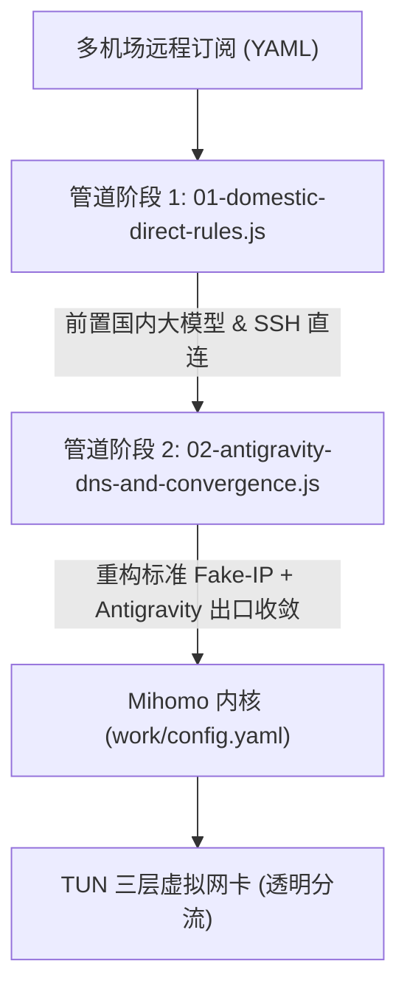

# Mihomo Party Overrides

**Mihomo (Clash Meta) 生产级 JavaScript 覆写规则集** —— 专为 Multi-Agent 开发、端云协同（Google Antigravity / Gemini / Claude）及高可用网络环境打造的底层管道过滤器。

---

## 一、 项目背景与解决的痛点

在混合使用多机场订阅、开发环境长连接及复杂分流场景下，常遇到以下三大核心痛点：

1. **订阅内置私有 DNS 紊乱**：
   部分机场下发订阅时强制注入异常保留网段（如 `28.0.0.1/8`）、未关闭的 `ipv6: true`（引发 5~10 秒 AAAA 解析超时）或失效的私有 DoH，导致切换订阅后 TUN 模式断网。
2. **图形界面「DNS 覆写」互斥死锁**：
   客户端自带的弱覆写开关在检测到订阅含有自定义 `dns:` 时，会自动弹窗告警并强制退回到关闭状态，无法对脏配置进行强制清洗。
3. **Google Antigravity / Gemini 长连接多出口 IP 漂移断联**：
   Antigravity 依赖分散的底层域名（`goog`, `run.app`, `googleapis.com` 等）。当订阅规则将不同子域名分流至不同落地节点时，出口 IP 不一致会触发 Google 安全风控，导致 Token 瞬时失效与会话频繁中断。

---

## 二、 架构分工与模块契约

本仓库提供两个职责正交、互不干扰的 JavaScript 覆写模块，执行于客户端启动管道的预编译阶段（Pre-Run Pipeline）：

### 1. `01-domestic-direct-rules.js` (国内大模型与直连保障)
- **职责边界**：应用层国内业务白名单。
- **核心逻辑**：
  - 前置注入商汤日日新 (`sensenova.cn`)、智谱 AI (`bigmodel.cn`)、火山引擎 (`volces.com`)、Agnes AI (`agnes-ai.cn`) 直连通道。
  - 前置注入微软 Bing (`bing.com`) 及 Microsoft Rewards 直连，防止跨区风控。
  - 绑定关键跳板机 SSH 端口直连，规避代理对长连接会话的截断。

### 2. `02-antigravity-dns-and-convergence.js` (标准 DNS 规范化与 Antigravity 出口收敛)
- **职责边界**：三层内核 DNS 固化与 AI 智能体开发出口收敛。
- **核心逻辑**：
  - **Fake-IP 规范化**：锁定 IETF RFC 2544 / RFC 5735 标准网段 `198.18.0.1/16`，移除通配符过滤黑名单。
  - **IPv6 抑制**：全域关闭 IPv6 解析，彻底解决 Windows 双栈网络超时。
  - **分层 DNS 拓扑**：国内 DoH/DoT（阿里/腾讯）与国际安全 DoH（Cloudflare/Google 8.8.8.8）严格隔离。
  - **Antigravity 专属防断联**：自适应遍历代理组，精准定位主策略组（如 `🚀 节点选择`），将 `goog`、`run.app`、`deepmind.google` 等关键域名强制收敛至同一通道，杜绝鉴权失效。

---

## 三、 安装与配置指引 (Mihomo Party)

1. 打开 **Mihomo Party**，进入左侧导航栏的 **「覆写（Override）」** 菜单。
2. 点击右上角 **「新建」**，选择类型为 **JavaScript**。
3. 分别创建两个覆写项并粘贴对应脚本内容：
   - 名称：`01-国内大模型直连保障` $\to$ 粘贴 `01-domestic-direct-rules.js`
   - 名称：`02-全局标准DNS与Antigravity保护` $\to$ 粘贴 `02-antigravity-dns-and-convergence.js`
4. 将两个覆写项均设置为 **「全局（Global）」** 状态。
5. 在配置页面点击 **「重新加载」**（或右键托盘图标点击 **「重启内核」**）即可全局生效。

---

## 四、 许可证

本项目基于 [MIT](LICENSE) 许可证开源。
